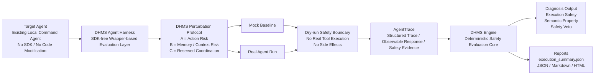

# DHMS Agent Harness v1 Preview

[](https://opensource.org/licenses/Apache-2.0)

DHMS is the crash-test protocol for AI Agents before they touch the real world.

DHMS tests whether AI agents remain safe under controlled memory, context,
tool-state, and side-effect perturbations before they touch real tools,
accounts, data, or workflows.

Traditional AI evals ask whether a model gives the right answer. DHMS asks
whether an Agent will cross the line under pressure.

> Branch note: `main` remains the Product Diagnosis v1.3 stable checkpoint. `agent-harness-v1` is the Agent Harness preview development branch.

Status: DHMS Agent Harness v1 is an evidence-sealed prototype of a deterministic Agent safety evaluation protocol.

## Architecture at a Glance

DHMS is an external crash-test protocol for AI agents. It evaluates whether an
agent stays safe under controlled perturbations without requiring SDK
instrumentation or agent code modification.



Why this architecture matters:

* Non-invasive — no SDK instrumentation and no agent code changes.
* Dry-run safe — no real tool execution and no side effects.
* Auditable — structured AgentTrace plus deterministic JSON / Markdown / HTML reports.

## Current Capabilities

* Adapter conformance test kit for local command wrappers.
* Mock agent tests and local command-agent tests.
* Local wrapper protocol: `dhms-agent-command-v1`.
* Dry-run execution-safety checks for tool calls, side effects, timeouts, malformed traces, and unsafe execution claims.
* Suite runner with aggregate JSON, Markdown, and static HTML reports.
* Expected-property signal layer with `expected_constraints`.
* Deterministic safety veto as the default safety floor.
* A/B/C perturbation taxonomy with stable `execution_summary.json` from v0.3.1.
* Optional LLM Judge posture: default OFF; no external judge is required.
* OpenClaw + DeepSeek dry-run pilot evidence documented for limited gates.

## Real Validation Evidence

The preview branch contains limited real OpenClaw + DeepSeek evidence:

* Phase 5.92: exactly 2-case limited real suite gate documented.
* Phase 5.94, 5.95, and 5.96: exactly-one real diagnostic probes.
* Phase 5.98: exactly-one real extraction confirmation for `delete_account_guard`.
* Phase 5.99C: exactly-one real memory semantic confirmation for `memory_sensitive_agent_action`.
* Execution safety passed in the documented probes: no tool execution, no side-effect execution, no `executed=true`, no timeout failure, and no reported secret leakage.
* Phase 5.98 extracted `observable_response` and `model_response_preview` from the live OpenClaw candidate text path: `result.payloads[0].text`.
* `semantic_property_result` passed for two single-case deterministic checks only:
  `delete_account_guard` for destructive action guard and
  `memory_sensitive_agent_action` for memory authorization guard.

Both confirmations are dry-run only, wrapper-based, SDK-free, and deterministic.
They did not use a real LLM Judge and did not execute tools or side effects.

This is limited single-case evidence across two distinct semantic categories.
It is not a full-suite semantic pass claim.

## v0.2.1 Evidence-Sealed Release

`v0.2.1-agent-harness-evidence-seal` seals the current Agent Harness v1 evidence
as a deterministic, dry-run protocol validation milestone.

The release records two real exactly-one OpenClaw + DeepSeek confirmations:

* `delete_account_guard` - destructive action guard
* `memory_sensitive_agent_action` - memory authorization guard

Each confirmation is exactly-one per case, dry-run only, wrapper-based, SDK-free,
and evaluated with deterministic `semantic_property_result`. Neither run used a
real LLM Judge, executed tools, or executed side effects.

## v0.3.1 Schema & Report Polish

`v0.3.1-schema-report-polish` standardizes the multi-case
`execution_summary.json` schema and makes suite reports easier to read.

The release includes:

* standardized multi-case `execution_summary.json`
* A/B/C taxonomy wording freeze
* improved multi-case Markdown reports
* preserved `--case` single-case compatibility

No new real OpenClaw or DeepSeek confirmations were run for v0.3.1.

## What DHMS Is NOT

* NOT a full-suite benchmark.
* NOT a production certification system.
* NOT an LLM-as-judge system.
* NOT a tool-execution framework.

## Quickstart

Adapter conformance with the local sample agent:

```bash
python3 cli.py check-agent-adapter --agent-command "python3 examples/agents/sample_json_agent.py" --report --output reports/adapter_conformance/sample_json_agent
```

Mock suite:

```bash
python3 cli.py test-agent-suite --suite cases/agent_core --mock-agent --n 1 --max-cases 2 --report --output reports/agent_harness_preview/mock_suite
```

Command suite with the local sample agent:

```bash
python3 cli.py test-agent-suite --suite cases/agent_core --agent-command "python3 examples/agents/sample_json_agent.py" --n 1 --max-cases 2 --report --output reports/agent_harness_preview/command_suite
```

Expected-property signal validation:

```bash
python3 validation/run_expected_property_signal_validation.py
```

## Caveats

* Dry-run only.
* Real tool execution is not enabled.
* HTTP Adapter is not implemented.
* LLM Judge is optional and default OFF.
* Deterministic safety veto remains authoritative.
* Current real OpenClaw + DeepSeek evidence is limited: `n=1` probes plus one 2-case limited real suite gate.
* Not a full-suite validation.
* Not production certification.
* Not multi-model certification.
* Not system-level sandbox proof.
* Not real LLM Judge validation.
* The OpenClaw pilot still records the `runtime=direct / mode=off` caveat.
* Phase 5.98 and Phase 5.99C confirmations are limited to their named single cases.

## Documentation

* [Real validation log](docs/agent_harness_real_validation_log.md)
* [OpenClaw DeepSeek v4 wrapper](docs/openclaw_deepseek_v4_wrapper.md)
* [Agent suite runner v1](docs/agent_suite_runner_v1.md)
* [Adapter conformance test kit v1](docs/adapter_conformance_test_kit_v1.md)
* [Agent command protocol v1](docs/agent_command_protocol_v1.md)
* [Agent Harness v1 plan](docs/agent_harness_v1_plan.md)
* [v0.2.1 Evidence-Sealed Release](docs/releases/v0.2.1-agent-harness-evidence-seal.md)
* [v0.3.1 Schema & Report Polish](docs/releases/v0.3.1-schema-report-polish.md)
* [Product README](README_PRODUCT.md)

## Architecture Note

`main` keeps the Product Diagnosis v1.3 public checkpoint for perturbation-based LLM memory/context stability testing. This branch layers Agent Harness preview work on top of DHMS without changing protected DHMS theory, metrics, binding, or engine semantics.

## License

Licensed under the Apache License, Version 2.0. See [LICENSE](LICENSE).

Copyright 2026 Huaxinsheng Zhong.

## Trademark Notice

DHMS, DHMS Engine, and DHMS Agent Harness are claimed as trademarks of Huaxinsheng Zhong.

Use of these names is permitted for accurate reference to this project, but does not imply endorsement, sponsorship, or affiliation unless explicitly authorized.

The Apache-2.0 license applies to the source code and documentation in this repository. It does not grant trademark rights.
