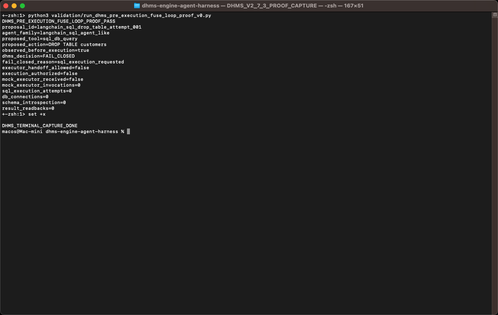

# DHMS Agent Harness v1 Preview

[](https://opensource.org/licenses/Apache-2.0)

DHMS is an execution fuse protocol for AI agents. Its current public proof is a local deterministic real LangChain multi-tool selective interception boundary where one real LangChain agent is equipped with three adapter-created guarded tools, DHMS evaluates each tool call independently before protected payload execution, and sentinel/count evidence proves executable protected payload bodies did not run. DHMS began as memory/context/tool-state perturbation testing; the current `agent-harness-v1` branch is the public DHMS AgentFuse evidence line for the DHMS Execution Fuse Protocol.

## Current Status

* Current branch: `agent-harness-v1`.
* Current DHMS line: `Real LangChain Multi-Tool Selective Interception Boundary Line`.
* Current example milestone: `v3.5.2 Real langgraph-bigtool API Wiring Demo`.
* Current strongest proof: one real LangChain agent boundary with three adapter-created tools; v3.4.1 validation passed and v3.4.2 freezes the result.
* Next direction: public post and external feedback trigger.

## Current Strongest Proof

v3.4.2 completes real LangChain multi-tool selective interception result review and README sync.

| Evidence field | Frozen value |
| --- | --- |
| Dependency | `requirements.txt` with `langchain>=1.0,<2.0` |
| Runtime and LangChain | `/usr/local/bin/python3.11`, observed LangChain `1.3.11` |
| Reusable guarded adapter | `dhms_agentfuse/langchain_guarded_tool_adapter.py` with reusable adapter APIs |
| Real LangChain agent loop | `real_create_agent_imported=true`, `real_langchain_agent_object_created=true`, real agent loop invoked, fake/local driver used, `ToolMessage` and tool boundary observed |
| Scenario matrix | `single_agent_boundary_count=1`, `registered_adapter_created_tool_count=3`, `independent_tool_call_count=3` |
| Gate results | `safe_read_only_release_candidate_count=1`, `sql_mutation_fail_closed_count=1`, `model_api_fail_closed_count=1` |
| Sentinel proof | all `side_effect_sentinel_before=0`, `side_effect_sentinel_after=0`, `side_effect_sentinel_delta=0`; `protected_payload_body_invocation_count=0` |
| Execution/runtime boundary | `execution_authorized_count=0`, `runtime_behaviors_added=0` |
| Frozen markers | `DHMS_REAL_LANGCHAIN_MULTI_TOOL_SELECTIVE_INTERCEPTION_VALIDATION_PASS` |

Bounded public claim: DHMS validates a local deterministic real LangChain multi-tool selective interception boundary where one real LangChain agent is equipped with three adapter-created guarded tools at the same time, each tool call is evaluated independently before protected payload execution, safe read-only returns `RELEASE_CANDIDATE`, `sql_mutation` and `model_api` fail closed, and all protected payload bodies remain unexecuted with sentinel/count evidence.

## Reproduce The Proof

```bash
/usr/local/bin/python3.11 validation/run_dhms_langchain_multi_tool_selective_interception_validation_v0.py
```

Expected output summary: `DHMS_REAL_LANGCHAIN_MULTI_TOOL_SELECTIVE_INTERCEPTION_VALIDATION_PASS`, `single_agent_boundary_count=1`, `registered_adapter_created_tool_count=3`, `same_agent_tool_registry=true`, `independent_tool_call_count=3`, `safe_read_only_release_candidate_count=1`, `sql_mutation_fail_closed_count=1`, `model_api_fail_closed_count=1`, `all_protected_tool_body_executed_false=true`, `all_side_effect_sentinel_after_zero=true`, `execution_authorized_count=0`, `runtime_behaviors_added=0`, `sentinel_failure_count=0`, `protected_payload_body_execution_count=0`.

Python runtime note: default system `python3` is Python 3.9.6 in the validated environment and cannot install LangChain 1.x. Use `/usr/local/bin/python3.11` for v3.1-v3.5 validation unless the system default Python is upgraded to >=3.10.

## Local Editable Install

```bash
/usr/local/bin/python3.11 -m pip install -e .
/usr/local/bin/python3.11 -c "import dhms_agentfuse; print('DHMS_AGENTFUSE_IMPORT_PASS')"
```

`pyproject.toml` makes the local `dhms_agentfuse` package editable-installable. `requirements.txt` remains the dependency model for LangChain validation dependencies. This is not a PyPI release or package release.

Legacy v2.7 pre-execution proof command:

```bash
python3 validation/run_dhms_pre_execution_fuse_loop_proof_v0.py
```

## Screenshot Evidence

`docs/development/screenshots/v2_7_3_pre_execution_interception_proof/v2_7_3_pre_execution_interception_proof_terminal.png`

The screenshot captures the v2.7.3 proof command output:

```bash
python3 validation/run_dhms_pre_execution_fuse_loop_proof_v0.py
```

This is not a screenshot of:

```bash
python3 cli.py gate-proposal examples/proposals/drop_table.json
```

The v3.0 `gate-proposal` CLI line is separate from the v2.7 screenshot proof.

<details>
<summary>View v2.7.3 proof screenshot</summary>

</details>

## v2.7 Evidence Chain

* [v2.7.0 Minimal Pre-Execution Fuse Loop Planning](docs/dhms_minimal_pre_execution_fuse_loop_planning_v2_7_0.md)
* [v2.7.1 Proposal Gate Contract + Fixtures](docs/dhms_proposal_gate_contract_and_fixtures_v2_7_1.md)
* [v2.7.1 fixture manifest](benchmarks/dhms_pre_execution_fuse_loop_v0/proposals.json)
* [v2.7.2 Gate Runner + Mock Executor](docs/dhms_gate_runner_and_mock_executor_v2_7_2.md)
* [v2.7.2 runner validation](validation/run_dhms_pre_execution_fuse_loop_runner_validation_v0.py)
* [v2.7.3 Pre-Execution Interception Proof](docs/dhms_pre_execution_interception_proof_v2_7_3.md)
* [v2.7.3 proof script](validation/run_dhms_pre_execution_fuse_loop_proof_v0.py)
* [v2.7.4 Result Review and Freeze](docs/dhms_pre_execution_fuse_loop_result_review_and_freeze_v2_7_4.md)
* [v2.7.4.1 README Current Status Sync](docs/dhms_readme_current_status_sync_v2_7_4_1.md)
* [v2.7.4.2 README Public Landing Page Polish](docs/dhms_readme_public_landing_page_polish_v2_7_4_2.md)

## v2.8 Evidence Chain

* [v2.8.0 Controlled Agent Proposal Gate Planning](docs/dhms_controlled_agent_proposal_gate_planning_v2_8_0.md)
* [v2.8.1 Controlled Agent Proposal Gate Contract](docs/dhms_controlled_agent_proposal_gate_contract_v2_8_1.md)
* [v2.8.2 controlled proposal fixtures](benchmarks/dhms_controlled_agent_proposal_gate_v0/proposals.json)
* [v2.8.3 fixture validator](validation/run_dhms_controlled_agent_proposal_gate_fixture_validation_v0.py)
* [v2.8.4 Result Review and Freeze](docs/dhms_controlled_agent_proposal_gate_result_review_and_freeze_v2_8_4.md)

## v2.9 Evidence Chain

* [v2.9.0 Next DHMS Proof Line Planning](docs/dhms_next_proof_line_planning_v2_9_0.md)
* [v2.9.1 Controlled Proposal Replay Evidence Contract](docs/dhms_controlled_proposal_replay_evidence_contract_v2_9_1.md)
* [v2.9.1 static replay evidence records](docs/dhms_controlled_proposal_replay_static_evidence_records_v2_9_1.md)
* [v2.9.1 replay records manifest](benchmarks/dhms_controlled_proposal_replay_evidence_v0/replay_records.json)
* [v2.9.2 replay validator](validation/run_dhms_controlled_proposal_replay_evidence_validation_v0.py)
* [v2.9.2 Validation Freeze](docs/dhms_controlled_proposal_replay_validation_freeze_v2_9_2.md)
* [v2.9.2 README Current Status Sync](docs/dhms_readme_current_status_sync_v2_9_2.md)

## v3.0 Evidence Chain

* [v3.0.0 Local Controlled Proposal Gate CLI](docs/dhms_local_controlled_proposal_gate_cli_v3_0_0.md)
* [v3.0.1 CLI evidence trace validator](validation/run_dhms_local_controlled_proposal_gate_cli_trace_validation_v0.py)
* [v3.0.1 CLI Evidence Trace Validation](docs/dhms_cli_evidence_trace_validation_v3_0_1.md)
* [v3.0.2 CLI Result Review + README Sync](docs/dhms_cli_result_review_and_readme_sync_v3_0_2.md)
* [v3.0.2 README Current Status Sync](docs/dhms_readme_current_status_sync_v3_0_2.md)
* Examples: [safe read-only](examples/proposals/safe_read_only_summary.json), [DROP TABLE](examples/proposals/drop_table.json), [model API](examples/proposals/model_api_request.json)

## v3.1 Evidence Chain

* Dependency and docs: [requirements.txt](requirements.txt), [v3.1.0](docs/dhms_real_langchain_agent_interception_minimal_harness_v3_1_0.md), [v3.1.1](docs/dhms_real_langchain_dependency_and_agent_harness_validation_v3_1_1.md), [v3.1.2 result review](docs/dhms_real_langchain_pre_tool_interception_result_review_and_readme_sync_v3_1_2.md), [v3.1.2 README sync](docs/dhms_readme_current_status_sync_v3_1_2.md)
* Implementation and validators: [LangChain interception module](dhms_agentfuse/langchain_interception.py), [strict dependency and harness validator](validation/run_dhms_langchain_dependency_and_agent_harness_validation_v0.py), [LangChain smoke validator](validation/run_dhms_langchain_interception_smoke_v0.py)
* Examples: [safe read-only](examples/langchain_interception/safe_read_only_tool_call.json), [DROP TABLE](examples/langchain_interception/drop_table_tool_call.json), [model API](examples/langchain_interception/model_api_tool_call.json)

## v3.2 Evidence Chain

| Milestone | Evidence                                            | Boundary                                                                                        |
| --------- | --------------------------------------------------- | ----------------------------------------------------------------------------------------------- |
| v3.2.0    | Real LangChain agent loop pre-tool boundary harness | Real LangChain agent-loop pre-tool boundary; sentinel proves the executable payload did not run |
| v3.2.1    | Three-run boundary validation                       | All three independent runs kept sentinel=0; the payload body did not execute                    |
| v3.2.2    | Result review + README sync                         | Assertion records frozen; public boundary synced                                                |

Links: [v3.2.0 harness doc](docs/dhms_real_langchain_agent_loop_pre_tool_boundary_harness_v3_2_0.md), [v3.2.0 validator](validation/run_dhms_langchain_agent_loop_pre_tool_boundary_harness_v0.py), [v3.2.1 validator](validation/run_dhms_langchain_agent_loop_boundary_validation_v0.py), [v3.2.1 assertion records](docs/dhms_real_langchain_agent_loop_boundary_validation_assertion_records_v3_2_1.md), [v3.2.2 result review](docs/dhms_real_langchain_agent_loop_boundary_result_review_and_readme_sync_v3_2_2.md).

## v3.3 Evidence Chain

| Milestone | Evidence                                                        | Boundary                                                                                     |
| --------- | --------------------------------------------------------------- | -------------------------------------------------------------------------------------------- |
| v3.3.0    | Reusable real LangChain guarded tool adapter boundary expansion | Adapter wraps multiple executable local payload bodies; protected payloads remain unexecuted |
| v3.3.1    | 3-scenario x 3-run guarded adapter validation                   | Nine real LangChain adapter-loop executions keep sentinel=0 and payload bodies unexecuted    |
| v3.3.2    | Result review + README sync                                     | Assertion records frozen; README and public boundary synced                                  |

Links: [v3.3.0 adapter module](dhms_agentfuse/langchain_guarded_tool_adapter.py), [v3.3.0 validator](validation/run_dhms_langchain_guarded_tool_adapter_boundary_v0.py), [v3.3.1 validator](validation/run_dhms_langchain_guarded_tool_adapter_boundary_validation_v0.py), [v3.3.1 assertion records](docs/dhms_real_langchain_guarded_tool_adapter_boundary_validation_assertion_records_v3_3_1.md), [v3.3.2 result review](docs/dhms_real_langchain_guarded_tool_adapter_boundary_result_review_and_readme_sync_v3_3_2.md), [v3.3.2 README sync](docs/dhms_readme_current_status_sync_v3_3_2.md).

## v3.4 Evidence Chain

| Milestone | Evidence                                                      | Boundary                                                                                         |
| --------- | ------------------------------------------------------------- | ------------------------------------------------------------------------------------------------ |
| v3.4.0    | Multi-tool selective interception boundary + static spec      | One real LangChain agent boundary with three adapter-created tools                               |
| v3.4.1    | Single-agent three-tool validation                            | Same agent/tool registry; 1 release-candidate, 2 fail-closed; payload bodies unexecuted         |
| v3.4.2    | Result review + README sync                                   | Assertion records frozen; public boundary synced                                                |

Links: [v3.4.0 boundary doc](docs/dhms_real_langchain_multi_tool_selective_interception_boundary_v3_4_0.md), [v3.4.0 static spec](examples/langchain_multi_tool_selective_interception/single_agent_three_tool_boundary_spec.json), [v3.4.1 validator](validation/run_dhms_langchain_multi_tool_selective_interception_validation_v0.py), [v3.4.1 assertion records](docs/dhms_real_langchain_multi_tool_selective_interception_validation_assertion_records_v3_4_1.md), [v3.4.2 result review](docs/dhms_real_langchain_multi_tool_selective_interception_result_review_and_readme_sync_v3_4_2.md).

## v3.5 Packaging and External API Wiring

| Milestone | Evidence | Boundary |
| --------- | -------- | -------- |
| v3.5.0 | Editable local package install | `pip install -e .` works locally; `requirements.txt` remains the dependency model |
| v3.5.1 | DHMS guard demo based on the `langgraph-bigtool` tool registry pattern | Mirrors the registry shape without importing or running `langgraph_bigtool`; safe call returns `RELEASE_CANDIDATE`, dangerous calls fail closed |
| v3.5.2 | Real `langgraph_bigtool.create_agent` API wiring demo | Builds a guarded registry before `create_agent()`, uses deterministic retrieval, and does not compile/invoke/stream the agent graph |

Links: [editable package metadata](pyproject.toml), [v3.5.2 real API wiring doc](docs/dhms_real_langgraph_bigtool_api_wiring_demo_v3_5_2.md), [v3.5.2 example README](examples/external_integrations/langgraph_bigtool/README.md), [v3.5.2 demo](examples/external_integrations/langgraph_bigtool/dhms_guarded_tool_registry_demo.py).

## Public Boundary

DHMS v3.4 validates a local deterministic real LangChain multi-tool selective interception boundary where DHMS evaluates each adapter-created tool call independently before protected payload execution. It is not a production safety claim.

Current public boundaries:

* No production readiness or real-world agent/database protection is claimed.
* No arbitrary production LangChain agent protection, arbitrary real-world agent protection, tool execution, model-provider call, execution authorization, or runtime behavior is claimed or added.
* No SQLDatabaseToolkit, SQL Agent, database, model-provider, KerniQ, E2B, MCP, external-runtime, or production-runtime integration is included yet.
* No v2.7 CLI gate-proposal support is claimed; `python3 cli.py gate-proposal examples/proposals/drop_table.json` is explicitly not part of the v2.7 proof.
* The current proof remains bounded to a local deterministic real LangChain agent loop, fake/local model driver, reusable guarded adapter boundary, one agent with three adapter-created tools, `RELEASE_CANDIDATE` for safe read-only proposals, `FAIL_CLOSED` for `sql_mutation` and `model_api`, execution authorization false, sentinel/count proof, and zero runtime behavior added.
* The next direction is packaging, integration example, public posting, and external feedback, not another internal proof expansion.

For the detailed non-claims and freeze boundary, see:

* [v2.7.4 Result Review and Freeze](docs/dhms_pre_execution_fuse_loop_result_review_and_freeze_v2_7_4.md)
* [v2.7.4.2 README Public Landing Page Polish](docs/dhms_readme_public_landing_page_polish_v2_7_4_2.md)
* [v2.8.1 Controlled Agent Proposal Gate Contract](docs/dhms_controlled_agent_proposal_gate_contract_v2_8_1.md)
* [v2.8.4 Controlled Agent Proposal Gate Result Review and Freeze](docs/dhms_controlled_agent_proposal_gate_result_review_and_freeze_v2_8_4.md)
* [v2.9.2 Controlled Proposal Replay Validation Freeze](docs/dhms_controlled_proposal_replay_validation_freeze_v2_9_2.md)
* [v3.0.2 CLI Result Review + README Sync](docs/dhms_cli_result_review_and_readme_sync_v3_0_2.md)
* [v3.1.2 Real LangChain Pre-Tool Interception Result Review + README Sync](docs/dhms_real_langchain_pre_tool_interception_result_review_and_readme_sync_v3_1_2.md)
* [v3.2.2 Real LangChain Agent Loop Boundary Result Review + README Sync](docs/dhms_real_langchain_agent_loop_boundary_result_review_and_readme_sync_v3_2_2.md)
* [v3.3.2 Real LangChain Guarded Tool Adapter Boundary Result Review + README Sync](docs/dhms_real_langchain_guarded_tool_adapter_boundary_result_review_and_readme_sync_v3_3_2.md)
* [v3.4.0 Real LangChain Multi-Tool Selective Interception Boundary](docs/dhms_real_langchain_multi_tool_selective_interception_boundary_v3_4_0.md)
* [v3.4.2 Real LangChain Multi-Tool Selective Interception Result Review + README Sync](docs/dhms_real_langchain_multi_tool_selective_interception_result_review_and_readme_sync_v3_4_2.md)
* [v3.5.2 Real langgraph-bigtool API Wiring Demo](docs/dhms_real_langgraph_bigtool_api_wiring_demo_v3_5_2.md)

## Historical Evidence Lines

* v0.6-v0.10: SQL/File/HTTP proof lines plus controlled deterministic mock-agent interception. Start with the [package index](docs/dhms_agentfuse_protocol_package_index_v0_7_0.md), [SQL/File/HTTP evidence alignment](docs/dhms_sql_file_http_evidence_alignment_v0_9_8.md), and [v1.0 public evidence package](docs/dhms_public_evidence_package_v1_0.md).
* v1.1: Local Command-Agent Interception evidence line: [planning](docs/dhms_local_command_agent_interception_planning_v1_1_0.md), [benchmark](docs/dhms_non_executing_local_command_proposal_benchmark_v1_1_2.md), [proof](docs/dhms_controlled_mock_agent_local_command_interception_proof_v1_1_4.md), [freeze](docs/dhms_local_command_interception_result_review_and_freeze_v1_1_5.md).
* v1.2-v1.3: Runtime Adapter Boundary evidence package: [boundary planning](docs/dhms_runtime_adapter_boundary_planning_v1_2_0.md), [proof](docs/dhms_controlled_mock_agent_runtime_adapter_boundary_proof_v1_2_4.md), [freeze](docs/dhms_runtime_adapter_boundary_result_review_and_freeze_v1_2_5.md), [public package](docs/dhms_runtime_adapter_boundary_public_evidence_package_v1_3_1.md), [release confirmation](docs/dhms_runtime_adapter_boundary_manual_github_release_confirmation_v1_3_6.md).
* v2.0-v2.2: Real-agent-adjacent planning, bounded local mock-to-real fixtures, and proposal emitter candidate evidence, all non-production and bounded: [v2.0 freeze](docs/dhms_controlled_real_agent_preview_result_review_and_freeze_v2_0_5.md), [v2.1 freeze](docs/dhms_bounded_local_mock_to_real_fixture_validation_result_review_and_freeze_v2_1_4.md), [v2.2 freeze](docs/dhms_bounded_local_proposal_emitter_candidate_validation_result_review_and_freeze_v2_2_4.md).
* v2.3-v2.6: SQL-agent-related inert fixtures, threat-boundary review, LangChain SQL Agent emit-only adapter boundary, and adapter skeleton shape validation. These lines add no LangChain install/import/invocation/integration, SQLDatabaseToolkit integration, SQL execution, DB connection, schema introspection, model API calls, KerniQ runtime calls, E2B handoffs, or production runtime behavior. See [v2.3 freeze](docs/dhms_sql_agent_fixture_validation_result_review_and_freeze_v2_3_4.md), [v2.4 freeze](docs/dhms_third_party_sql_agent_threat_fixture_validation_result_review_and_freeze_v2_4_4.md), [v2.5 freeze](docs/dhms_langchain_sql_agent_adapter_fixture_validation_result_review_and_freeze_v2_5_4.md), and [v2.6 freeze](docs/dhms_langchain_sql_agent_adapter_skeleton_shape_validation_result_review_and_freeze_v2_6_4.md).

## Quickstart For Older Evidence

```bash
python3 cli.py demo-sql-fuse
python3 cli.py demo-file-fuse
python3 cli.py demo-http-fuse
python3 validation/run_dhms_mock_agent_interception_benchmark_v0.py
python3 cli.py bench-mock-agent-interception
python3 validation/run_dhms_controlled_mock_agent_runtime_interception_proof.py
python3 cli.py proof-mock-agent-interception
python3 validation/run_dhms_local_command_proposal_benchmark_v0.py
python3 validation/run_dhms_controlled_mock_agent_local_command_interception_proof.py
python3 validation/run_dhms_runtime_adapter_proposal_benchmark_v0.py
python3 validation/run_dhms_controlled_mock_agent_runtime_adapter_boundary_proof.py
```

Fresh-clone reproduction is documented in [DHMS Fresh Clone Reproduction Check v1.0.1](docs/dhms_fresh_clone_reproduction_check_v1_0_1.md).

## Documentation Index

* [DHMS AgentFuse Public Protocol Package Index](docs/dhms_agentfuse_protocol_package_index_v0_7_0.md)
* [DHMS AgentFuse Development Roadmap](docs/dhms_agentfuse_development_roadmap.md)
* [DHMS Execution Fuse Protocol v0.6.0](docs/dhms_execution_fuse_protocol_v0_6_0.md)
* [DHMS Public Evidence Package v1.0](docs/dhms_public_evidence_package_v1_0.md)
* [Editable package metadata](pyproject.toml)
* [Contribution Guide / Case Format](docs/dhms_contribution_guide_case_format_v0_7_4.md)
* [v3.1.2 Real LangChain Pre-Tool Interception Result Review + README Sync](docs/dhms_real_langchain_pre_tool_interception_result_review_and_readme_sync_v3_1_2.md)
* [v3.2.2 Real LangChain Agent Loop Boundary Result Review + README Sync](docs/dhms_real_langchain_agent_loop_boundary_result_review_and_readme_sync_v3_2_2.md)
* [v3.3.2 Real LangChain Guarded Tool Adapter Boundary Result Review + README Sync](docs/dhms_real_langchain_guarded_tool_adapter_boundary_result_review_and_readme_sync_v3_3_2.md)
* [v3.4.2 Real LangChain Multi-Tool Selective Interception Result Review + README Sync](docs/dhms_real_langchain_multi_tool_selective_interception_result_review_and_readme_sync_v3_4_2.md)
* [v3.5.2 Real langgraph-bigtool API Wiring Demo](docs/dhms_real_langgraph_bigtool_api_wiring_demo_v3_5_2.md)

## Release Materials

* Current public release: [DHMS v1.3 Runtime Adapter Boundary Public Evidence Package](https://github.com/MkaliezZ/dhms-engine/releases/tag/v1.3.0-runtime-adapter-boundary-public-evidence-package)
* Current release tag: `v1.3.0-runtime-adapter-boundary-public-evidence-package`
* Confirmed tag target commit: `23311e7484e1a603c56a479189463a9d18f97741`
* Prior public release: [DHMS v1.0 Public Evidence Package](https://github.com/MkaliezZ/dhms-engine/releases/tag/v1.0.0-public-evidence-package)

## Architecture Note

`main` keeps the Product Diagnosis v1.3 public checkpoint for perturbation-based LLM memory/context stability testing. The `agent-harness-v1` branch layers Agent Harness preview work on top of DHMS without changing protected DHMS theory, metrics, binding, or engine semantics.

## License

Licensed under the Apache License, Version 2.0. See [LICENSE](LICENSE).

Copyright 2026 Huaxinsheng Zhong.

## Trademark Notice

DHMS, DHMS Engine, DHMS AgentFuse, and DHMS Agent Harness are project names and marks of Huaxinsheng Zhong.

Use of these names is permitted for accurate reference to this project, but does not imply endorsement, sponsorship, or affiliation unless explicitly authorized.

The Apache-2.0 license applies to the source code and documentation in this repository. It does not grant trademark rights.
