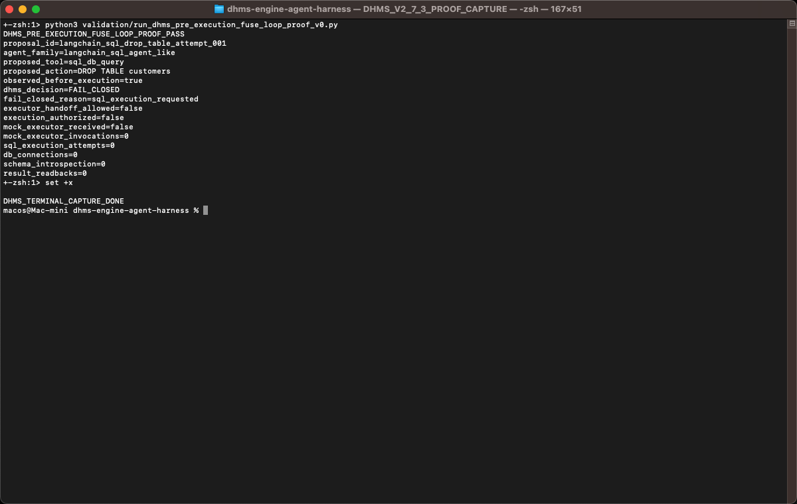

# DHMS / AgentFuse

[](LICENSE)
[](pyproject.toml)
[](#quickstart)
[](docs/dhms_real_langgraph_bigtool_api_wiring_demo_v3_5_2.md)
[](docs/)

Current local package identity: `dhms-agentfuse 3.6.0`.

Historical evidence milestone: `v3.5.2`. Evidence schema:
`agentfuse-evidence-schema-v0.1`.

Experimental in-process pre-dispatch control and evidence for AI agent tools.

The AgentFuse Runtime Guard evaluates policy before dispatching a Python tool
handler, blocks disallowed calls, and generates structured execution or
non-execution evidence from the same code path that owns dispatch. It supports
synchronous and asynchronous handlers, sequential mixed-call batches, and a
real LangGraph `ToolNode` integration.

The existing Evidence Schema, denial fixtures, LangChain proof chain, and
`langgraph_bigtool.create_agent()` wiring remain supporting evidence.

AI agents increasingly call tools that can mutate SQL, files, APIs, code, or
business systems. DHMS / AgentFuse focuses on the execution boundary before a
tool's protected payload runs: classify risky tool capabilities, release only
bounded safe candidates, and fail closed for known-dangerous or unsupported
actions before protected payload execution.

<a id="chinese-overview"></a>
Chinese overview: [README.zh-CN.md](README.zh-CN.md)

## Quickstart

```bash
pip install -e .
python examples/runtime_guard/runtime_guard_mvp_demo.py
python examples/runtime_guard/langgraph_runtime_guard_demo.py
```

Expected final verdicts:

```text
AGENTFUSE_RUNTIME_GUARD_MVP_DEMO_PASS
AGENTFUSE_LANGGRAPH_RUNTIME_GUARD_DEMO_PASS
```

If your system `python` is older than Python 3.10, use a Python 3.11 runtime:

```bash
/usr/local/bin/python3.11 -m pip install -e .
/usr/local/bin/python3.11 examples/runtime_guard/runtime_guard_mvp_demo.py
/usr/local/bin/python3.11 examples/runtime_guard/langgraph_runtime_guard_demo.py
```

## AgentFuse Runtime Guard MVP

The Runtime Guard solves one narrow problem: evaluate policy before dispatching
an agent tool handler, block disallowed execution, and generate structured
execution or non-execution evidence from the same control path.

### Synchronous Handler

```python
from dhms_agentfuse import RuntimeGuard, ToolCallRequest

guard = RuntimeGuard(
    allow_tools={"search", "read_file"},
    deny_tools={"delete_file", "execute_sql", "send_external_message"},
    default_action="block",
)

result = guard.invoke(
    tool_call=ToolCallRequest(
        tool_call_id="call-001",
        tool_name="delete_file",
        arguments={"path": "synthetic-example.txt"},
    ),
    handler=delete_file_handler,
)

assert result.outcome == "not_executed"
assert result.handler_invoked is False
```

An explicit denylist match has highest precedence. When `allow_tools` is
configured, a tool absent from that set is blocked. A custom policy may further
allow or block calls that pass static configuration; policy exceptions and
invalid decisions fail closed.

```python
from dhms_agentfuse import RuntimePolicyDecision

def policy(tool_call):
    if tool_call.safe_metadata.get("requires_approval"):
        return RuntimePolicyDecision.block("policy_denied")
    return RuntimePolicyDecision.allow()

guard = RuntimeGuard(default_action="block", policy=policy)
```

### Decision-Only API

Use `evaluate()` when another runtime owns approval, dispatch, and physical
outcome recording:

```python
decision = guard.evaluate(tool_call)

assert decision.action in {"allow", "block"}
assert decision.evidence.schema_version == "agentfuse-evidence-schema-v0.1"
```

For asynchronous custom policies, use `await guard.aevaluate(tool_call)`.
Neither method accepts a handler, dispatches a tool, or performs the protected
side effect. `invoke()` and `ainvoke()` use the same decision path and may
dispatch only after that public decision allows the call.

See
[`docs/dhms_agentfuse_public_decision_api_v3_6_0.md`](docs/dhms_agentfuse_public_decision_api_v3_6_0.md)
for the complete contract.

### Asynchronous Handler

```python
result = await guard.ainvoke(
    tool_call=tool_call,
    handler=async_handler,
)
```

Use `ainvoke` for async handlers or async custom policies. The guard does not
run async handlers through an implicit event loop.

### Sequential Batch

```python
from dhms_agentfuse import GuardedInvocation

results = guard.invoke_batch(
    invocations=[
        GuardedInvocation(tool_call=blocked_call, handler=blocked_handler),
        GuardedInvocation(tool_call=allowed_call, handler=allowed_handler),
    ]
)
```

Each input receives one result in input order. A blocked call, policy failure,
or handler exception does not suppress later calls in the sequential batch.

### LangGraph ToolNode

```python
from langgraph.graph import MessagesState, StateGraph
from dhms_agentfuse import LangGraphRuntimeGuardAdapter

adapter = LangGraphRuntimeGuardAdapter(guard)
builder = StateGraph(MessagesState)
builder.add_node("tools", adapter.create_tool_node([read_file, delete_file]))
builder.set_entry_point("tools")
builder.set_finish_point("tools")
graph = builder.compile()
```

The adapter uses the installed LangGraph `ToolNode` dispatch path. Blocked calls
receive a terminal `ToolMessage` bound to the original tool-call ID; allowed
handlers use normal ToolNode execution; handler exceptions remain terminal
execution failures rather than policy denials. Evidence receipts are available
through `adapter.receipts` and `adapter.receipt_for(tool_call_id)`.

Representative safe output:

```text
delete_file:
decision=block
outcome=not_executed
handler_invoked=false

read_project_summary:
decision=allow
outcome=executed
handler_invoked=true
```

The Runtime Guard MVP guarantees only that handlers passed through the guard
are evaluated before dispatch, blocked handlers are not called by that guarded
path, and evidence is generated by that path. Successful return values remain
available on `result.return_value` but are excluded from `to_safe_dict()` and
the default representation.

AgentFuse Runtime Guard MVP is an experimental in-process pre-dispatch control
layer. It is not a process sandbox, network firewall, or universal
production-security boundary. Application code can still call handlers
directly; other processes, subprocesses, monkey-patching, network traffic, and
unwrapped LangGraph paths are not automatically intercepted. It provides no
enterprise-security, compliance, certification, or universal side-effect
prevention guarantee.

## Supporting External-Facing Proof

* Current branch: `agent-harness-v1`.
* Supporting proof chain: v3.4.2 frozen multi-tool selective interception result review.
* Latest external-facing demo: v3.5.2 real `langgraph_bigtool.create_agent()` API wiring.
* Demo path: `examples/external_integrations/langgraph_bigtool/`.
* `safe_read_only_summary_tool` returns `RELEASE_CANDIDATE`.
* `dangerous_sql_mutation_tool` fails closed with blocked category `sql_mutation`.
* `model_api_request_tool` fails closed with blocked category `model_api`.
* `protected_payload_body_execution_count = 0`.
* `runtime_behaviors_added = 0`.
* `execution_authorized_count = 0`.

v3.5.2 remains the latest historical external-project wiring demo. The Runtime
Guard MVP above is now the primary current-use path; v3.4.2 and v3.5.2 remain
supporting proof-chain checkpoints.

## AgentFuse Evidence Schema v0.1

AgentFuse Evidence Schema v0.1 represents blocked agent tool calls as completed
policy decisions, not failed tool executions. It captures policy resolution,
non-execution evidence, layered boundary decisions, and safe trace metadata for
guarded tool-call proposals.

The schema keeps approval and execution as separate lifecycle facts. A denied
tool call can carry `status=not_executed`, `execution=not_started`, a reason
code, safe policy metadata, and an evidence reference without exposing raw
arguments, raw paths, environment variables, request bodies, secrets, or other
sensitive payloads in default traces.

This is feedback-informed schema/demo work, not a production runtime security
claim. It preserves the existing boundary: no live graph invocation is required,
no provider calls are made, no protected payload executes, and no raw sensitive
inputs are included in default traces.

## Five-Minute Per-Call Denial Trial

After `pip install -e .`, run:

```bash
python examples/trial/per_call_denial_lifecycle_demo.py
```

The deterministic two-call batch denies one mutation-style call before its
handler starts, then executes one inert read-only handler exactly once. Both
calls receive terminal lifecycle records, and the denied call does not abort
the allowed call. Expected verdict:

```text
AGENTFUSE_PER_CALL_DENIAL_TRIAL_DEMO_PASS
```

This is a local schema/demo example. It does not invoke a provider, model,
network, database, SQL system, graph, credential source, or external service,
and it does not claim production runtime protection.

### Regression Fixtures for Denied Tool Calls

The provider-neutral, copyable fixtures cover terminal denial records,
preserved tool-call identity, and allowed-call continuation after a denial.
They are in
[`examples/trial/denial_lifecycle_regression_fixtures/fixtures.json`](examples/trial/denial_lifecycle_regression_fixtures/fixtures.json)
with a concise [fixture README](examples/trial/denial_lifecycle_regression_fixtures/README.md).
The existing trial demo remains the runnable reference.

## Table of Contents

* [Overview](#overview)
* [Quickstart](#quickstart)
* [AgentFuse Runtime Guard MVP](#agentfuse-runtime-guard-mvp)
* [Supporting External-Facing Proof](#supporting-external-facing-proof)
* [AgentFuse Evidence Schema v0.1](#agentfuse-evidence-schema-v01)
* [Five-Minute Per-Call Denial Trial](#five-minute-per-call-denial-trial)
* [What DHMS Does](#what-dhms-does)
* [What DHMS Does Not Claim](#what-dhms-does-not-claim)
* [Latest Demo](#latest-demo)
* [Evidence Chain](#evidence-chain)
* [Feedback Wanted](#feedback-wanted)
* [Chinese Overview](#chinese-overview)

## Overview

DHMS began as memory/context/tool-state perturbation testing. The
`agent-harness-v1` branch is the public DHMS AgentFuse evidence line for the
DHMS Execution Fuse Protocol.

## What DHMS Does

DHMS / AgentFuse provides an experimental in-process Runtime Guard for
side-effect-capable AI agent tools. It evaluates allowlist, denylist, default,
and optional custom policy decisions before guarded handler dispatch and emits
safe receipts from that same path. Existing schema and proof artifacts remain
available for regression and portability work.

## What DHMS Does Not Claim

DHMS / AgentFuse is not claiming universal production runtime protection. The
Runtime Guard controls only handlers routed through its API or its explicit
LangGraph adapter. Direct calls and unwrapped execution paths remain possible.

The historical v3.5.2 demo:

* does not compile, invoke, or stream the graph
* does not call providers, networks, databases, SQL systems, credentials, or user data
* does not call providers or real model APIs
* does not perform network requests
* does not access databases
* does not execute SQL
* does not read credentials, environment variables, or user data
* does not authorize protected payload execution
* does not claim to protect live production LangGraph agents
* does not claim LangChain or LangGraph lacks safety mechanisms
* does not claim DHMS is a finished enterprise security product

## Latest Demo

The two current Runtime Guard demos perform real guarded handler dispatch and a
real installed-LangGraph `ToolNode` graph invocation with deterministic,
in-memory handlers. They make no provider or model call and perform no real
file, SQL, network, or messaging operation.

The historical v3.5.2 demo remains available to demonstrate
`langgraph_bigtool.create_agent()` API wiring. It builds a guarded registry but
does not compile, invoke, or stream that historical graph.

## Evidence Chain

The strongest frozen proof-chain foundation remains v3.4.2: a local deterministic real LangChain
multi-tool selective interception boundary where one real LangChain agent has
three adapter-created guarded tools. DHMS evaluates each tool call independently
before protected payload execution, safe read-only returns `RELEASE_CANDIDATE`,
`sql_mutation` and `model_api` fail closed, and all protected payload bodies
remain unexecuted with sentinel/count evidence.

| Evidence field | Frozen value |
| --- | --- |
| Dependency | `requirements.txt` with `langchain>=1.0,<2.0` |
| Runtime and LangChain | `/usr/local/bin/python3.11`, observed LangChain `1.3.11` |
| Reusable guarded adapter | `dhms_agentfuse/langchain_guarded_tool_adapter.py` with reusable adapter APIs |
| Real LangChain agent loop | `real_create_agent_imported=true`, `real_langchain_agent_object_created=true`, real agent loop invoked, fake/local driver used, `ToolMessage` and tool boundary observed |
| Scenario matrix | `single_agent_boundary_count=1`, `registered_adapter_created_tool_count=3`, `independent_tool_call_count=3` |
| Gate results | `safe_read_only_release_candidate_count=1`, `sql_mutation_fail_closed_count=1`, `model_api_fail_closed_count=1` |
| Sentinel proof | all `side_effect_sentinel_before=0`, `side_effect_sentinel_after=0`, `side_effect_sentinel_delta=0`; `protected_payload_body_invocation_count=0` |
| Execution/runtime boundary | `execution_authorized_count=0`, `runtime_behaviors_added=0` |
| Frozen marker | `DHMS_REAL_LANGCHAIN_MULTI_TOOL_SELECTIVE_INTERCEPTION_VALIDATION_PASS` |

## Reproduce The Proof

```bash
/usr/local/bin/python3.11 validation/run_dhms_langchain_multi_tool_selective_interception_validation_v0.py
```

Expected output summary: `DHMS_REAL_LANGCHAIN_MULTI_TOOL_SELECTIVE_INTERCEPTION_VALIDATION_PASS`, `single_agent_boundary_count=1`, `registered_adapter_created_tool_count=3`, `same_agent_tool_registry=true`, `independent_tool_call_count=3`, `safe_read_only_release_candidate_count=1`, `sql_mutation_fail_closed_count=1`, `model_api_fail_closed_count=1`, `all_protected_tool_body_executed_false=true`, `all_side_effect_sentinel_after_zero=true`, `execution_authorized_count=0`, `runtime_behaviors_added=0`, `sentinel_failure_count=0`, `protected_payload_body_execution_count=0`.

`pyproject.toml` makes the local `dhms_agentfuse` package editable-installable.
`requirements.txt` remains the dependency model for LangChain validation
dependencies. This is not a PyPI release or package release.

## Feedback Wanted

Feedback is especially useful on whether the guarded tool registry boundary is
easy to understand, whether the v3.5.2 non-claims are clear enough, and which
side-effect-capable tool risks should be prioritized next.

Legacy v2.7 pre-execution proof command:

```bash
python3 validation/run_dhms_pre_execution_fuse_loop_proof_v0.py
```

## Screenshot Evidence

`docs/development/screenshots/v2_7_3_pre_execution_interception_proof/v2_7_3_pre_execution_interception_proof_terminal.png`

The screenshot captures the v2.7.3 proof command output:

```bash
python3 validation/run_dhms_pre_execution_fuse_loop_proof_v0.py
```

This is not a screenshot of:

```bash
python3 cli.py gate-proposal examples/proposals/drop_table.json
```

The v3.0 `gate-proposal` CLI line is separate from the v2.7 screenshot proof.

<details>
<summary>View v2.7.3 proof screenshot</summary>



</details>

## v2.7 Evidence Chain

* [v2.7.0 Minimal Pre-Execution Fuse Loop Planning](docs/dhms_minimal_pre_execution_fuse_loop_planning_v2_7_0.md)
* [v2.7.1 Proposal Gate Contract + Fixtures](docs/dhms_proposal_gate_contract_and_fixtures_v2_7_1.md)
* [v2.7.1 fixture manifest](benchmarks/dhms_pre_execution_fuse_loop_v0/proposals.json)
* [v2.7.2 Gate Runner + Mock Executor](docs/dhms_gate_runner_and_mock_executor_v2_7_2.md)
* [v2.7.2 runner validation](validation/run_dhms_pre_execution_fuse_loop_runner_validation_v0.py)
* [v2.7.3 Pre-Execution Interception Proof](docs/dhms_pre_execution_interception_proof_v2_7_3.md)
* [v2.7.3 proof script](validation/run_dhms_pre_execution_fuse_loop_proof_v0.py)
* [v2.7.4 Result Review and Freeze](docs/dhms_pre_execution_fuse_loop_result_review_and_freeze_v2_7_4.md)
* [v2.7.4.1 README Current Status Sync](docs/dhms_readme_current_status_sync_v2_7_4_1.md)
* [v2.7.4.2 README Public Landing Page Polish](docs/dhms_readme_public_landing_page_polish_v2_7_4_2.md)

## v2.8 Evidence Chain

* [v2.8.0 Controlled Agent Proposal Gate Planning](docs/dhms_controlled_agent_proposal_gate_planning_v2_8_0.md)
* [v2.8.1 Controlled Agent Proposal Gate Contract](docs/dhms_controlled_agent_proposal_gate_contract_v2_8_1.md)
* [v2.8.2 controlled proposal fixtures](benchmarks/dhms_controlled_agent_proposal_gate_v0/proposals.json)
* [v2.8.3 fixture validator](validation/run_dhms_controlled_agent_proposal_gate_fixture_validation_v0.py)
* [v2.8.4 Result Review and Freeze](docs/dhms_controlled_agent_proposal_gate_result_review_and_freeze_v2_8_4.md)

## v2.9 Evidence Chain

* [v2.9.0 Next DHMS Proof Line Planning](docs/dhms_next_proof_line_planning_v2_9_0.md)
* [v2.9.1 Controlled Proposal Replay Evidence Contract](docs/dhms_controlled_proposal_replay_evidence_contract_v2_9_1.md)
* [v2.9.1 static replay evidence records](docs/dhms_controlled_proposal_replay_static_evidence_records_v2_9_1.md)
* [v2.9.1 replay records manifest](benchmarks/dhms_controlled_proposal_replay_evidence_v0/replay_records.json)
* [v2.9.2 replay validator](validation/run_dhms_controlled_proposal_replay_evidence_validation_v0.py)
* [v2.9.2 Validation Freeze](docs/dhms_controlled_proposal_replay_validation_freeze_v2_9_2.md)
* [v2.9.2 README Current Status Sync](docs/dhms_readme_current_status_sync_v2_9_2.md)

## v3.0 Evidence Chain

* [v3.0.0 Local Controlled Proposal Gate CLI](docs/dhms_local_controlled_proposal_gate_cli_v3_0_0.md)
* [v3.0.1 CLI evidence trace validator](validation/run_dhms_local_controlled_proposal_gate_cli_trace_validation_v0.py)
* [v3.0.1 CLI Evidence Trace Validation](docs/dhms_cli_evidence_trace_validation_v3_0_1.md)
* [v3.0.2 CLI Result Review + README Sync](docs/dhms_cli_result_review_and_readme_sync_v3_0_2.md)
* [v3.0.2 README Current Status Sync](docs/dhms_readme_current_status_sync_v3_0_2.md)
* Examples: [safe read-only](examples/proposals/safe_read_only_summary.json), [DROP TABLE](examples/proposals/drop_table.json), [model API](examples/proposals/model_api_request.json)

## v3.1 Evidence Chain

* Dependency and docs: [requirements.txt](requirements.txt), [v3.1.0](docs/dhms_real_langchain_agent_interception_minimal_harness_v3_1_0.md), [v3.1.1](docs/dhms_real_langchain_dependency_and_agent_harness_validation_v3_1_1.md), [v3.1.2 result review](docs/dhms_real_langchain_pre_tool_interception_result_review_and_readme_sync_v3_1_2.md), [v3.1.2 README sync](docs/dhms_readme_current_status_sync_v3_1_2.md)
* Implementation and validators: [LangChain interception module](dhms_agentfuse/langchain_interception.py), [strict dependency and harness validator](validation/run_dhms_langchain_dependency_and_agent_harness_validation_v0.py), [LangChain smoke validator](validation/run_dhms_langchain_interception_smoke_v0.py)
* Examples: [safe read-only](examples/langchain_interception/safe_read_only_tool_call.json), [DROP TABLE](examples/langchain_interception/drop_table_tool_call.json), [model API](examples/langchain_interception/model_api_tool_call.json)

## v3.2 Evidence Chain

| Milestone | Evidence                                            | Boundary                                                                                        |
| --------- | --------------------------------------------------- | ----------------------------------------------------------------------------------------------- |
| v3.2.0    | Real LangChain agent loop pre-tool boundary harness | Real LangChain agent-loop pre-tool boundary; sentinel proves the executable payload did not run |
| v3.2.1    | Three-run boundary validation                       | All three independent runs kept sentinel=0; the payload body did not execute                    |
| v3.2.2    | Result review + README sync                         | Assertion records frozen; public boundary synced                                                |

Links: [v3.2.0 harness doc](docs/dhms_real_langchain_agent_loop_pre_tool_boundary_harness_v3_2_0.md), [v3.2.0 validator](validation/run_dhms_langchain_agent_loop_pre_tool_boundary_harness_v0.py), [v3.2.1 validator](validation/run_dhms_langchain_agent_loop_boundary_validation_v0.py), [v3.2.1 assertion records](docs/dhms_real_langchain_agent_loop_boundary_validation_assertion_records_v3_2_1.md), [v3.2.2 result review](docs/dhms_real_langchain_agent_loop_boundary_result_review_and_readme_sync_v3_2_2.md).

## v3.3 Evidence Chain

| Milestone | Evidence                                                        | Boundary                                                                                     |
| --------- | --------------------------------------------------------------- | -------------------------------------------------------------------------------------------- |
| v3.3.0    | Reusable real LangChain guarded tool adapter boundary expansion | Adapter wraps multiple executable local payload bodies; protected payloads remain unexecuted |
| v3.3.1    | 3-scenario x 3-run guarded adapter validation                   | Nine real LangChain adapter-loop executions keep sentinel=0 and payload bodies unexecuted    |
| v3.3.2    | Result review + README sync                                     | Assertion records frozen; README and public boundary synced                                  |

Links: [v3.3.0 adapter module](dhms_agentfuse/langchain_guarded_tool_adapter.py), [v3.3.0 validator](validation/run_dhms_langchain_guarded_tool_adapter_boundary_v0.py), [v3.3.1 validator](validation/run_dhms_langchain_guarded_tool_adapter_boundary_validation_v0.py), [v3.3.1 assertion records](docs/dhms_real_langchain_guarded_tool_adapter_boundary_validation_assertion_records_v3_3_1.md), [v3.3.2 result review](docs/dhms_real_langchain_guarded_tool_adapter_boundary_result_review_and_readme_sync_v3_3_2.md), [v3.3.2 README sync](docs/dhms_readme_current_status_sync_v3_3_2.md).

## v3.4 Evidence Chain

| Milestone | Evidence                                                      | Boundary                                                                                         |
| --------- | ------------------------------------------------------------- | ------------------------------------------------------------------------------------------------ |
| v3.4.0    | Multi-tool selective interception boundary + static spec      | One real LangChain agent boundary with three adapter-created tools                               |
| v3.4.1    | Single-agent three-tool validation                            | Same agent/tool registry; 1 release-candidate, 2 fail-closed; payload bodies unexecuted         |
| v3.4.2    | Result review + README sync                                   | Assertion records frozen; public boundary synced                                                |

Links: [v3.4.0 boundary doc](docs/dhms_real_langchain_multi_tool_selective_interception_boundary_v3_4_0.md), [v3.4.0 static spec](examples/langchain_multi_tool_selective_interception/single_agent_three_tool_boundary_spec.json), [v3.4.1 validator](validation/run_dhms_langchain_multi_tool_selective_interception_validation_v0.py), [v3.4.1 assertion records](docs/dhms_real_langchain_multi_tool_selective_interception_validation_assertion_records_v3_4_1.md), [v3.4.2 result review](docs/dhms_real_langchain_multi_tool_selective_interception_result_review_and_readme_sync_v3_4_2.md).

## v3.5 Packaging and External API Wiring

| Milestone | Evidence | Boundary |
| --------- | -------- | -------- |
| v3.5.0 | Editable local package install | `pip install -e .` works locally; `requirements.txt` remains the dependency model |
| v3.5.1 | DHMS guard demo based on the `langgraph-bigtool` tool registry pattern | Mirrors the registry shape without importing or running `langgraph_bigtool`; safe call returns `RELEASE_CANDIDATE`, dangerous calls fail closed |
| v3.5.2 | Real `langgraph_bigtool.create_agent` API wiring demo | Builds a guarded registry before `create_agent()`, uses deterministic retrieval, and does not compile/invoke/stream the agent graph |

Links: [editable package metadata](pyproject.toml), [v3.5.2 real API wiring doc](docs/dhms_real_langgraph_bigtool_api_wiring_demo_v3_5_2.md), [v3.5.2 example README](examples/external_integrations/langgraph_bigtool/README.md), [v3.5.2 demo](examples/external_integrations/langgraph_bigtool/dhms_guarded_tool_registry_demo.py).

## Public Boundary

DHMS v3.5.2 shows real `langgraph_bigtool.create_agent()` API wiring with a
guarded tool registry. The frozen v3.4.2 proof remains the strongest
multi-tool selective interception evidence. Neither is a production safety
claim.

Current public boundaries:

* No production readiness or real-world agent/database protection is claimed.
* No arbitrary production LangChain agent protection, arbitrary real-world agent protection, tool execution, model-provider call, execution authorization, or runtime behavior is claimed or added.
* No SQLDatabaseToolkit, SQL Agent, database, model-provider, KerniQ, E2B, MCP, external-runtime, or production-runtime integration is included yet.
* No v2.7 CLI gate-proposal support is claimed; `python3 cli.py gate-proposal examples/proposals/drop_table.json` is explicitly not part of the v2.7 proof.
* The current proof remains bounded to a local deterministic real LangChain agent loop, fake/local model driver, reusable guarded adapter boundary, one agent with three adapter-created tools, `RELEASE_CANDIDATE` for safe read-only proposals, `FAIL_CLOSED` for `sql_mutation` and `model_api`, execution authorization false, sentinel/count proof, and zero runtime behavior added.
* The next direction is packaging, integration example, public posting, and external feedback, not another internal proof expansion.

For the detailed non-claims and freeze boundary, see:

* [v2.7.4 Result Review and Freeze](docs/dhms_pre_execution_fuse_loop_result_review_and_freeze_v2_7_4.md)
* [v2.7.4.2 README Public Landing Page Polish](docs/dhms_readme_public_landing_page_polish_v2_7_4_2.md)
* [v2.8.1 Controlled Agent Proposal Gate Contract](docs/dhms_controlled_agent_proposal_gate_contract_v2_8_1.md)
* [v2.8.4 Controlled Agent Proposal Gate Result Review and Freeze](docs/dhms_controlled_agent_proposal_gate_result_review_and_freeze_v2_8_4.md)
* [v2.9.2 Controlled Proposal Replay Validation Freeze](docs/dhms_controlled_proposal_replay_validation_freeze_v2_9_2.md)
* [v3.0.2 CLI Result Review + README Sync](docs/dhms_cli_result_review_and_readme_sync_v3_0_2.md)
* [v3.1.2 Real LangChain Pre-Tool Interception Result Review + README Sync](docs/dhms_real_langchain_pre_tool_interception_result_review_and_readme_sync_v3_1_2.md)
* [v3.2.2 Real LangChain Agent Loop Boundary Result Review + README Sync](docs/dhms_real_langchain_agent_loop_boundary_result_review_and_readme_sync_v3_2_2.md)
* [v3.3.2 Real LangChain Guarded Tool Adapter Boundary Result Review + README Sync](docs/dhms_real_langchain_guarded_tool_adapter_boundary_result_review_and_readme_sync_v3_3_2.md)
* [v3.4.0 Real LangChain Multi-Tool Selective Interception Boundary](docs/dhms_real_langchain_multi_tool_selective_interception_boundary_v3_4_0.md)
* [v3.4.2 Real LangChain Multi-Tool Selective Interception Result Review + README Sync](docs/dhms_real_langchain_multi_tool_selective_interception_result_review_and_readme_sync_v3_4_2.md)
* [v3.5.2 Real langgraph-bigtool API Wiring Demo](docs/dhms_real_langgraph_bigtool_api_wiring_demo_v3_5_2.md)

## Historical Evidence Lines

* v0.6-v0.10: SQL/File/HTTP proof lines plus controlled deterministic mock-agent interception. Start with the [package index](docs/dhms_agentfuse_protocol_package_index_v0_7_0.md), [SQL/File/HTTP evidence alignment](docs/dhms_sql_file_http_evidence_alignment_v0_9_8.md), and [v1.0 public evidence package](docs/dhms_public_evidence_package_v1_0.md).
* v1.1: Local Command-Agent Interception evidence line: [planning](docs/dhms_local_command_agent_interception_planning_v1_1_0.md), [benchmark](docs/dhms_non_executing_local_command_proposal_benchmark_v1_1_2.md), [proof](docs/dhms_controlled_mock_agent_local_command_interception_proof_v1_1_4.md), [freeze](docs/dhms_local_command_interception_result_review_and_freeze_v1_1_5.md).
* v1.2-v1.3: Runtime Adapter Boundary evidence package: [boundary planning](docs/dhms_runtime_adapter_boundary_planning_v1_2_0.md), [proof](docs/dhms_controlled_mock_agent_runtime_adapter_boundary_proof_v1_2_4.md), [freeze](docs/dhms_runtime_adapter_boundary_result_review_and_freeze_v1_2_5.md), [public package](docs/dhms_runtime_adapter_boundary_public_evidence_package_v1_3_1.md), [release confirmation](docs/dhms_runtime_adapter_boundary_manual_github_release_confirmation_v1_3_6.md).
* v2.0-v2.2: Real-agent-adjacent planning, bounded local mock-to-real fixtures, and proposal emitter candidate evidence, all non-production and bounded: [v2.0 freeze](docs/dhms_controlled_real_agent_preview_result_review_and_freeze_v2_0_5.md), [v2.1 freeze](docs/dhms_bounded_local_mock_to_real_fixture_validation_result_review_and_freeze_v2_1_4.md), [v2.2 freeze](docs/dhms_bounded_local_proposal_emitter_candidate_validation_result_review_and_freeze_v2_2_4.md).
* v2.3-v2.6: SQL-agent-related inert fixtures, threat-boundary review, LangChain SQL Agent emit-only adapter boundary, and adapter skeleton shape validation. These lines add no LangChain install/import/invocation/integration, SQLDatabaseToolkit integration, SQL execution, DB connection, schema introspection, model API calls, KerniQ runtime calls, E2B handoffs, or production runtime behavior. See [v2.3 freeze](docs/dhms_sql_agent_fixture_validation_result_review_and_freeze_v2_3_4.md), [v2.4 freeze](docs/dhms_third_party_sql_agent_threat_fixture_validation_result_review_and_freeze_v2_4_4.md), [v2.5 freeze](docs/dhms_langchain_sql_agent_adapter_fixture_validation_result_review_and_freeze_v2_5_4.md), and [v2.6 freeze](docs/dhms_langchain_sql_agent_adapter_skeleton_shape_validation_result_review_and_freeze_v2_6_4.md).

## Quickstart For Older Evidence

```bash
python3 cli.py demo-sql-fuse
python3 cli.py demo-file-fuse
python3 cli.py demo-http-fuse
python3 validation/run_dhms_mock_agent_interception_benchmark_v0.py
python3 cli.py bench-mock-agent-interception
python3 validation/run_dhms_controlled_mock_agent_runtime_interception_proof.py
python3 cli.py proof-mock-agent-interception
python3 validation/run_dhms_local_command_proposal_benchmark_v0.py
python3 validation/run_dhms_controlled_mock_agent_local_command_interception_proof.py
python3 validation/run_dhms_runtime_adapter_proposal_benchmark_v0.py
python3 validation/run_dhms_controlled_mock_agent_runtime_adapter_boundary_proof.py
```

Fresh-clone reproduction is documented in [DHMS Fresh Clone Reproduction Check v1.0.1](docs/dhms_fresh_clone_reproduction_check_v1_0_1.md).

## Documentation Index

* [DHMS AgentFuse Public Protocol Package Index](docs/dhms_agentfuse_protocol_package_index_v0_7_0.md)
* [DHMS AgentFuse Development Roadmap](docs/dhms_agentfuse_development_roadmap.md)
* [DHMS Execution Fuse Protocol v0.6.0](docs/dhms_execution_fuse_protocol_v0_6_0.md)
* [DHMS Public Evidence Package v1.0](docs/dhms_public_evidence_package_v1_0.md)
* [Editable package metadata](pyproject.toml)
* [Contribution Guide / Case Format](docs/dhms_contribution_guide_case_format_v0_7_4.md)
* [v3.1.2 Real LangChain Pre-Tool Interception Result Review + README Sync](docs/dhms_real_langchain_pre_tool_interception_result_review_and_readme_sync_v3_1_2.md)
* [v3.2.2 Real LangChain Agent Loop Boundary Result Review + README Sync](docs/dhms_real_langchain_agent_loop_boundary_result_review_and_readme_sync_v3_2_2.md)
* [v3.3.2 Real LangChain Guarded Tool Adapter Boundary Result Review + README Sync](docs/dhms_real_langchain_guarded_tool_adapter_boundary_result_review_and_readme_sync_v3_3_2.md)
* [v3.4.2 Real LangChain Multi-Tool Selective Interception Result Review + README Sync](docs/dhms_real_langchain_multi_tool_selective_interception_result_review_and_readme_sync_v3_4_2.md)
* [v3.5.2 Real langgraph-bigtool API Wiring Demo](docs/dhms_real_langgraph_bigtool_api_wiring_demo_v3_5_2.md)

## Historical Release Materials

* Historical public release: [DHMS v1.3 Runtime Adapter Boundary Public Evidence Package](https://github.com/MkaliezZ/dhms-engine/releases/tag/v1.3.0-runtime-adapter-boundary-public-evidence-package)
* Historical v1.3 release tag: `v1.3.0-runtime-adapter-boundary-public-evidence-package`
* Historical v1.3 tag target commit: `23311e7484e1a603c56a479189463a9d18f97741`
* Prior public release: [DHMS v1.0 Public Evidence Package](https://github.com/MkaliezZ/dhms-engine/releases/tag/v1.0.0-public-evidence-package)

## Architecture Note

`main` keeps the Product Diagnosis v1.3 public checkpoint for perturbation-based LLM memory/context stability testing. The `agent-harness-v1` branch layers Agent Harness preview work on top of DHMS without changing protected DHMS theory, metrics, binding, or engine semantics.

## License

Licensed under the Apache License, Version 2.0. See [LICENSE](LICENSE).

Copyright 2026 Huaxinsheng Zhong.

## Trademark Notice

DHMS, DHMS Engine, DHMS AgentFuse, and DHMS Agent Harness are project names and marks of Huaxinsheng Zhong.

Use of these names is permitted for accurate reference to this project, but does not imply endorsement, sponsorship, or affiliation unless explicitly authorized.

The Apache-2.0 license applies to the source code and documentation in this repository. It does not grant trademark rights.
